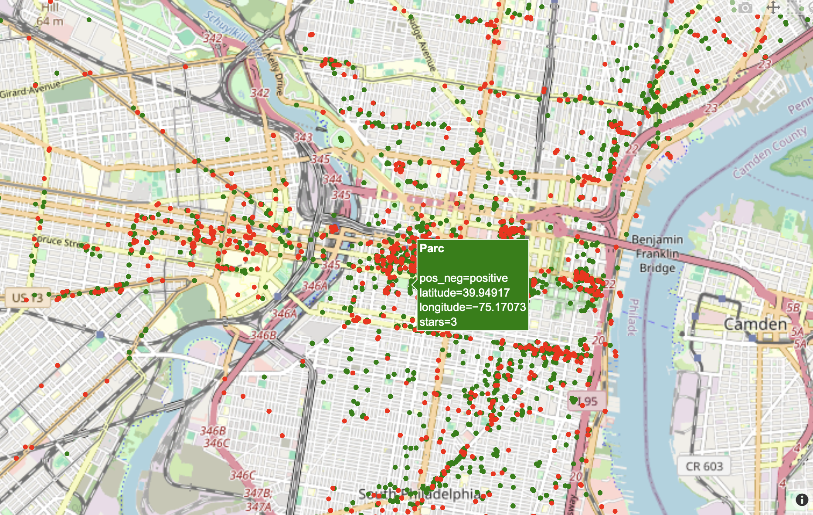
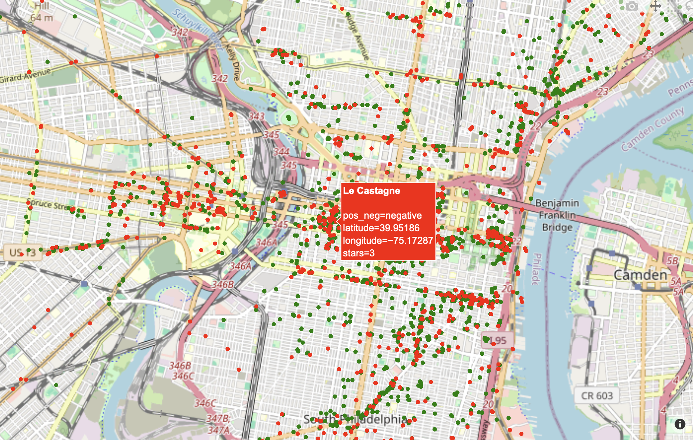

# yelp-reviews-analysis-spark-project
---
Built a scalable sentiment analysis pipeline using PySpark and NLP techniques to process 7M+ Yelp reviews, reducing runtime from 85 minutes to 30 seconds and extracting sentiment, emotion, and geospatial insights to support data-driven decision-making.

**Impact & Business Applications**

This project demonstrates how combining big data processing (Spark) with natural language processing (NLP) can transform large volumes of unstructured customer feedback into actionable insights at scale. By reducing processing time from over an hour to seconds, the pipeline enables near real-time analysis of millions of reviews, making it practical for operational and strategic use.
From a business perspective, this approach provides a more nuanced understanding of customer experience beyond star ratings. Sentiment and emotion analysis allow organizations to identify patterns in customer satisfaction, detect emerging issues, and understand how specific aspects of service influence perception.

**Key applications include:**

- **Customer Experience Monitoring**

  Track sentiment trends over time to identify declines in satisfaction and proactively address issues.
- **Reputation Management**
  
  Quickly detect negative sentiment clusters and respond to customer concerns before they escalate.
- **Competitive Analysis**
  
  Compare sentiment across businesses or regions to identify strengths and weaknesses relative to competitors.
- **Location-Based Insights**
  
  Use geospatial visualization to identify high- and low-performing areas, supporting targeted business decisions.
- **Product and Service Improvement**
  
  Leverage emotion analysis to understand what drives customer reactions (e.g., surprise, trust), informing improvements in offerings.

# 🍽️ Yelp Big Data Sentiment Analysis

**Big Data | NLP | Distributed Computing (Spark)**

## 📌 Overview

This project analyzes large-scale Yelp review data to extract **customer sentiment and emotional insights** using natural language processing and distributed computing. The goal was to build a scalable pipeline capable of processing millions of reviews and translating unstructured text into actionable insights for users and businesses.

---

## 📊 Dataset

* Source: Yelp Open Dataset (Kaggle)

  https://www.kaggle.com/datasets/yelp-dataset/yelp-dataset

* ~7M reviews (~5.3GB JSON)
* ~2M users
* ~150K businesses

---

## 🧠 Methods Implemented

### 1. Sentiment Analysis (TextBlob)

* Classified reviews as positive or negative
* Generated sentiment scores for businesses

---

### 2. Emotion Analysis (NLTK)

* Used NRC Emotion Lexicon
* Extracted 8 emotions:

  * anger, anticipation, disgust, fear, joy, sadness, surprise, trust

---

### 3. Distributed Processing (Apache Spark) ⭐

* Migrated pipeline from Pandas to PySpark
* Processed large-scale data using HDFS and AWS EC2
* Achieved significant performance improvements

---

### 4. Geospatial Visualization

* Built interactive maps using Plotly/Mapbox
* Visualized sentiment distribution across businesses

  * Green = Positive
  * Red = Negative

  
  

---

## 📈 Results

* Reduced processing time from:

  * **~1 hour 25 minutes → ~30 seconds** using Spark
* Identified:

  * **2.88× more positive than negative sentiment terms**
  * Most common emotion: **Surprise**
  * Least common emotion: **Disgust**
* Developed geospatial visualization of sentiment across businesses

---

## 🔍 Key Findings

* Distributed computing with **Spark drastically improves scalability and performance** for large datasets.
* Sentiment analysis reveals patterns not captured by star ratings alone.
* Emotion analysis provides **deeper insights into customer experience** beyond polarity.
* Geospatial visualization enables intuitive understanding of business performance across locations.

---

## ⚙️ Tech Stack

* **Python**
* PySpark, Pandas
* TextBlob, NLTK
* Apache Spark, Hadoop (HDFS)
* AWS EC2
* Matplotlib, Plotly, Mapbox

---

## ⚙️ Modeling Approach

* Conducted **EDA** to understand review distributions and user behavior
* Applied **TextBlob** for sentiment classification
* Used **NRC Lexicon (NLTK)** for emotion extraction
* Scaled pipeline using **PySpark on AWS EC2 cluster**
* Built **interactive geospatial visualizations** to communicate insights

---

## ⚠️ Limitations

* Sentiment model limited to polarity (positive/negative)
* Lexicon-based emotion detection may miss context
* Batch processing (not real-time)

---

## 🚀 Key Takeaway

This project demonstrates that combining **big data frameworks (Spark)** with **NLP techniques** enables efficient analysis of large-scale unstructured text, uncovering meaningful insights that improve decision-making for both users and businesses.

---

